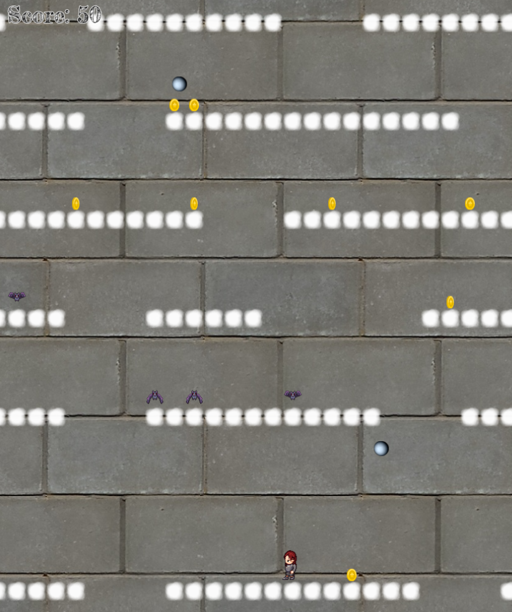

# The Extortion

## About the Project

Game developed in JavaScript using [Phaser 3](https://www.phaser.io/phaser3) game framework.

Þrymr has stolen Thor's hammer to extort the gods into giving him Freyja as his wife.
Would you travel to Jötunheimr and climb the walls of Útgarðar to help Thor recover his hammer?

Use right and left keyboard keys to move, and mouse left click (or up keyboard key) to jump.

The goal of the game is to climb the walls and collect the coins to get as many points as possible.

You can die in three different ways:
- Falling to the ground.
- Getting hit by a rock thrown by Þrymr.
- Being bitten by one of Þrymr's pets.

There is a leaderboard with the 8 top scores.

Make Odin proud and claim your position among the best.

Enjoy the game!

## Table of Contents

* [About the Project](#about-the-project)
* [Built With](#built-with)
* [Live Demo](#live-demo)
* [Getting Started](#getting-started)
* [Authors](#authors)
* [Contributing](#contributing)
* [Show your support](#show-your-support)
* [License](#license)
* [Acknowledgements](#acknowledgements)

## Built With

* [HTML5](https://en.wikipedia.org/wiki/HTML5)
* [SASS(SCSS)](https://sass-lang.com/)
* [JavaScript](https://en.wikipedia.org/wiki/JavaScript)
* [Node package manager](https://www.npmjs.com/)
* [Phaser 3](https://www.phaser.io/phaser3)
* [Jest](https://jestjs.io/)

## Live Demo

[Live Demo Link](https://mv-todo-list.netlify.app/)

## Getting Started

To get a local copy up and running follow these simple example steps.

1. On the project GitHub page, navigate to the main page of the repository.
2. Under the repository name, locate and click on a green button named `Code`.
3. Copy the project URL as displayed.
4. If you're running the Windows Operating System, open your command prompt. On Linux, Open your terminal.
5. Change the current working directory to the location where you want the cloned directory to be made. Leave as it is if the current location is where you want the project to be.
6. Type git clone, and then paste the URL you copied in Step 3.  
e.g. $ `git clone https://github.com/Zappat0n/todo_list.git`.
7. Press Enter. Your local copy will be created.
8. On your console, move to the place where this folder is cloned.
9. Run `npm install`. If you do not have `npm` installed you can get it from [here](https://www.npmjs.com/).
10. Run `npm start`, to start the server.
11. To test, run `npm test`.

## Authors

👤 **Angel Barros**

- GitHub: [@Zappat0n](https://github.com/Zappat0n)
- LinkedIn: [LinkedIn](https://www.linkedin.com/in/angel-barros/)

## Contributing

Contributions, issues, and feature requests are welcome!
Feel free to check the [issues page](../../issues).

1. Fork the Project
2. Create your Feature Branch (`git checkout -b feature/AmazingFeature`)
3. Commit your Changes (`git commit -m 'Add some AmazingFeature'`)
4. Push to the Branch (`git push origin feature/AmazingFeature`)
5. Open a Pull Request

## Show your support

Give a ⭐️ if you like this project!

## License

This project is [MIT](./LICENSE) licensed.

## Acknowledgements
* [Photo by ANIRUDH](https://unsplash.com/@lanirudhreddy?utm_source=unsplash&amp;utm_medium=referral&amp;utm_content=creditCopyText) from [Unsplash](https://unsplash.com/s/photos/thor?utm_source=unsplash&amp;utm_medium=referral&amp;utm_content=creditCopyText)
* [Player generator](http://gaurav.munjal.us/Universal-LPC-Spritesheet-Character-Generator/#?=eyes_brown&armor=chest_plate&hair=long_brunette&jacket=none&shoes=boots_metal&spikes=none&mail=chain)
* [Clouds](https://unsplash.com/s/photos/thor?utm_source=unsplash&amp;utm_medium=referral&amp;utm_content=creditCopyText)
* [Walls](https://unsplash.com/s/photos/thor?utm_source=unsplash&amp;utm_medium=referral&amp;utm_content=creditCopyText)
* [Bats](https://opengameart.org/content/bat-sprite)
* [Rocks](https://opengameart.org/content/ice-type-planet)
* [Buttons](https://opengameart.org/content/ui-button-and-extra)
